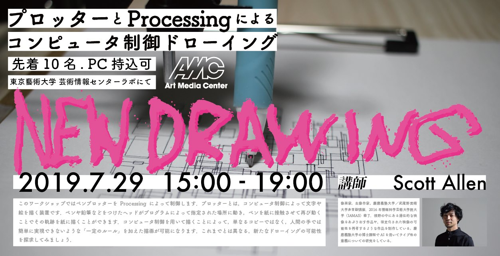

# grblP5
grbl library for Processing.  
This repo is focused on using only plotters, laser cutter because of not considering z-axis and linear power.

## demo


# usage
All method is like Processing.  
## rectangle
```rect(float x, float y, float w, float h)```  

## circle
```circle(float x, float y, float r)```  

## line
```line(float x1, float y1, float x2, float y2)```  

## Examples
Examples/basic/bacis.pde

## To-do
More examples for geidai plotter workshop.

## geidai workshop

